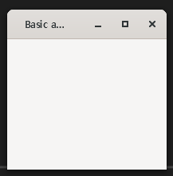

# GTKMM-4.0VcpkgCmakeExample

### 
WARNING

NEVER EXPECT EVERYTHING WOULD WORK AS SAME AS GNOME ENVIRONMENT

OTHER PLATFORMS ARE UNSTABLE (crash often, runtime error that says "something is not initialized", bugs in example codes - drag and drop doesn't work properly and duplicate garbage icons that won't be removed until you manually kill that process)

ALSO NEVER THINK GTKMM AS QT'S ALTERNATIVE. QT HANDLES CROSS-PLATFORM ISSUES WAY BETTER THAN QTKMM.

JUST THINK GTKMM AS GUI. NOTHING ELSE.

GTKMM-4.0 example on Visual studio 2019 + Vcpkg + Cmake + PkgConfig setting

1. Install visual studio 2019 with required c++ build tools, cmake tool, language pack(english)
2. Install vcpkg to C:/dev, so that exetutable path `C:/dev/vcpkg/vcpkg.exe` exists.
3. Install CMake
4. Install Windows SDK if needed
5. Install Gtkmm-4.0 from vcpkg `vcpkg install gtkmm`
6. Install PkgConf from vcpkg `vcpkg install pkgconf`
7. Install vcpkg-pkgconfig-get-modules `vcpkg install vcpkg-pkgconfig-get-modules`
8. git clone this project from visual studio
9. run program

### Preview

